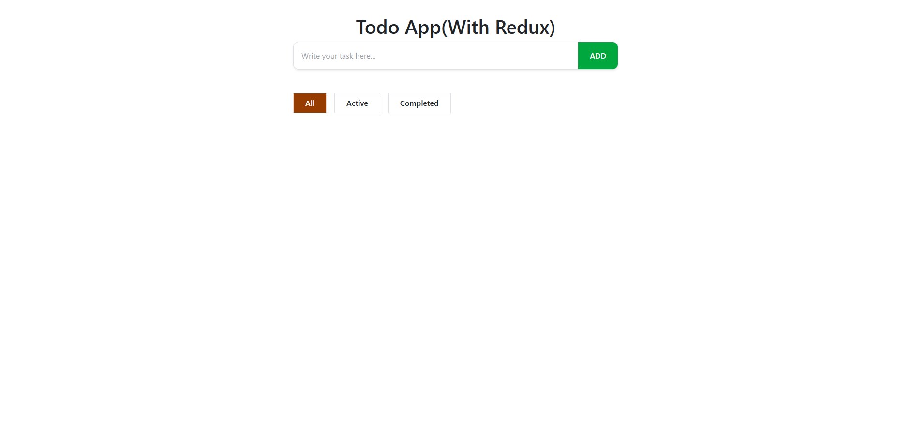

<<<<<<< HEAD
# React + Vite

This template provides a minimal setup to get React working in Vite with HMR and some ESLint rules.

Currently, two official plugins are available:

- [@vitejs/plugin-react](https://github.com/vitejs/vite-plugin-react/blob/main/packages/plugin-react) uses [Babel](https://babeljs.io/) for Fast Refresh
- [@vitejs/plugin-react-swc](https://github.com/vitejs/vite-plugin-react/blob/main/packages/plugin-react-swc) uses [SWC](https://swc.rs/) for Fast Refresh

## Expanding the ESLint configuration

If you are developing a production application, we recommend using TypeScript with type-aware lint rules enabled. Check out the [TS template](https://github.com/vitejs/vite/tree/main/packages/create-vite/template-react-ts) for information on how to integrate TypeScript and [`typescript-eslint`](https://typescript-eslint.io) in your project.
=======
# 📝 Todo App (React + Redux Toolkit)


A modern Todo Application built with React, Redux Toolkit and LocalStorage.  
This app allows users to add, update, delete and filter todos with persistent storage.

---

## 🚀 Features

- ➕ Add Todo
- ✏️ Edit Todo
- ✅ Mark as Completed
- ❌ Delete Todo
- 🔍 Filter Todos (All / Active / Completed)
- 💾 Data Persistence using LocalStorage
- 🎨 Modern UI with Tailwind CSS

---

## 🛠️ Tech Stack

- React
- Redux Toolkit
- React-Redux
- Tailwind CSS
- Lucide React Icons
- Vite

---

## 📸 Screenshots

### 🏠 Home Page


> Make sure your screenshots are inside a folder named `screenshots` in the root directory.

---

## 🧠 How It Works

- Todos are stored in Redux global state.
- LocalStorage is used to persist data even after page refresh.
- Filter logic dynamically filters based on:
  - **Active** → `isComplete === false`
  - **Completed** → `isComplete === true`
  - **All** → Show all todos

State structure:

```js
{
  value: [],       // Todo list
  filter: "All"    // Current filter
}
```

---

## ⚙️ Installation & Setup

### 1️⃣ Clone the repository

```bash
git clone https://github.com/your-username/todo-redux.git
```

### 2️⃣ Navigate to project folder

```bash
cd todo-redux
```

### 3️⃣ Install dependencies

```bash
npm install
```

### 4️⃣ Run the development server

```bash
npm run dev
```

App will run on:

```
http://localhost:5173/
```

---

## 📂 Project Structure

```
todo-redux/
│
├── screenshots/
├── public/
├── src/
│   ├── Component/
│   │   ├── TodoForm.jsx
│   │   ├── FilterTabs.jsx
│   │   ├── Todo.jsx
│   │   ├── EditTodo.jsx
│   │   ├── Delete.jsx
│   │   ├── Done.jsx
│   │
│   ├── redux/
│   │   ├── todoSlice.js
│   │   ├── store.js
│   │
│   ├── App.jsx
│   ├── main.jsx
│
├── package.json
├── README.md
```

---
 
 

## 👨‍💻 Author

**Sounava Mukherjee**

---

⭐ If you like this project, give it a star on GitHub!
>>>>>>> 995822a516f23a26955f7c8921268676fc2321a6
